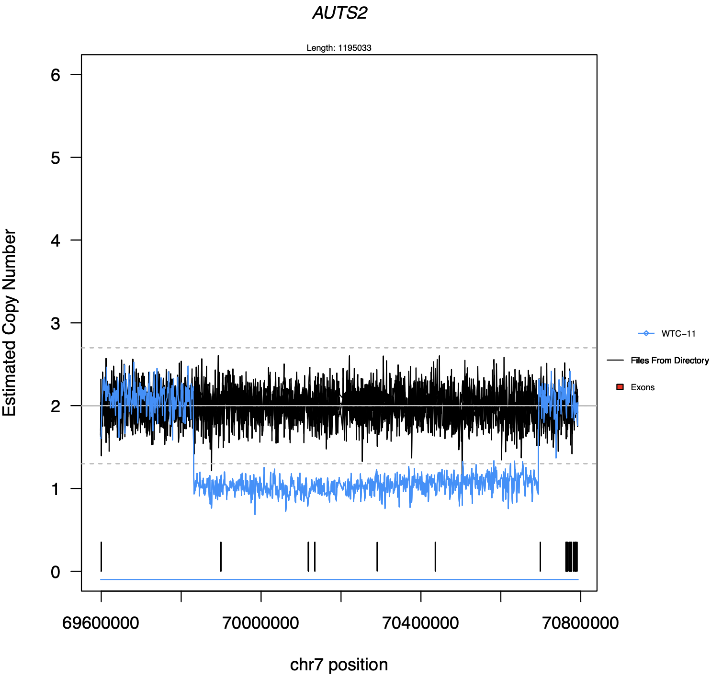
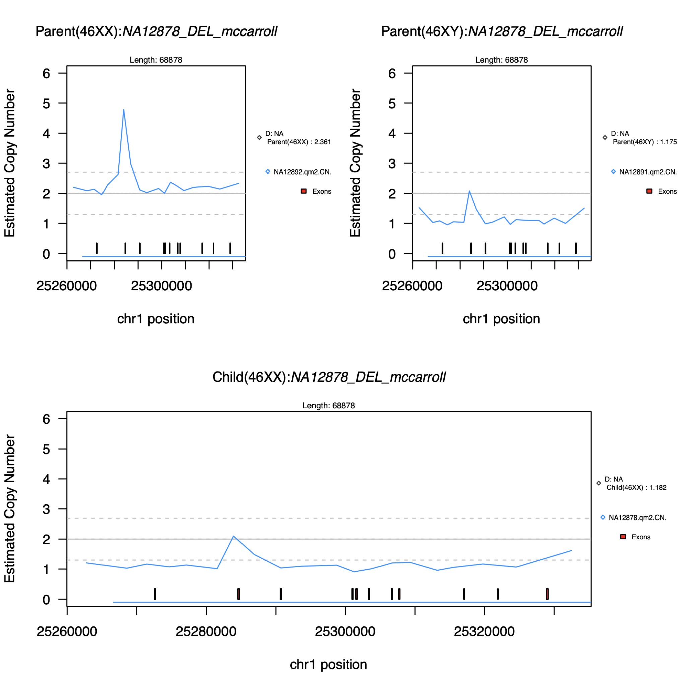

\setlength{\headheight}{63.55022pt}

# Statement of need

Identifying copy number variation in whole-genome sequencing data has been
challenging and one approach to assessing this data is through visualization of
the underlying copy number estimates. In family-based studies, it can be 
especially beneficial to plot data from the parents and the children to confirm
inheritance patterns. A tool is needed to plot copy number estimates for 
one to many samples in a rapid manner. PYRUS is a stand-alone R script
with multiple capabilities for plotting copy number data.

# Summary

`PYRUS` is a tool for plotting copy number estimate data, from an individual, 
for user-specified regions of the genome. It has several options including 
plotting other individuals in the same region, plotting an annotation track, 
and writing out specific regions where the individuals have a copy number 
below or above given copy number thresholds. Inputs to the tool are 
bgzipped and tabix indexed bed file(s) for the primary individual and 
a gzipped bed file containing coordinates to be plotted from the genome.
Utilizing compressed files and tabix both saves space and enables rapid
plotting of the data. 

Popular tools for generating copy number estimates across the genome are 
QuicK-mer2 [@Shen:2020] and fastCN [@Pendleton:2018]. These programs
output bed files containing windows of the genome with copy number estimates.
Plotting estimates from these bed files as-is can be quite slow and so we require 
users to bgzip and tabix-index the output bed files for input into `PYRUS`. This 
allows us to utilize tabix [@Li:2011] to quickly pull regions of the genome for 
plotting with `PYRUS`.

We have built-in several features to `PYRUS` beyond only plotting the individual
copy number estimates for a given region. These include 1) plotting a directory
of files with copy number estimates, 2) customizing the colors on different aspects
of the plot, 3) customizing the maximum copy number to be plotted, 4) adding an
annotation track, 5) adding a boxplot of the copy number estimates from all 
individuals to the top-right of the plot, 6) printing out a file with regions above or 
below given copy number thresholds, and 7) plotting trios from family data.

`PYRUS` is publicly available at https://github.com/TNTurnerLab/PYRUS and 
released under the MIT license.

# Figures

 

 

# Data
Data from the Allen Institute for Cell Science Parental WTC-11 Genome were downloaded 
from https://www.allencell.org/genomics.html and data for individuals NA12878, NA12891,
and NA12892 were downloaded from the 1000 Genomes project resource as described here
https://www.internationalgenome.org/data-portal/data-collection/30x-grch38. All four 
individuals were run through QuicK-mer2 to generate genome-wide copy number estimates.
Coordinates for plotting Fig.2 were derived from [@Mills:2011] Supplementary Table 5.

# Acknowledgements

This work was supported by a grant from the National Institutes of Health (R00MH117165).

# References
